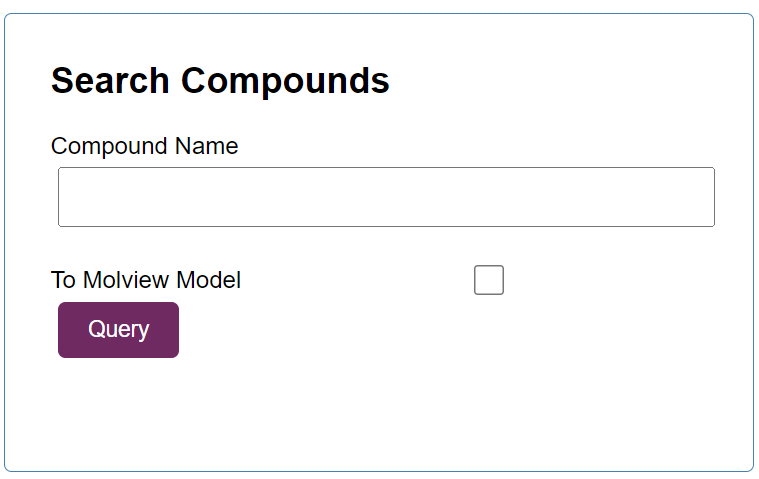
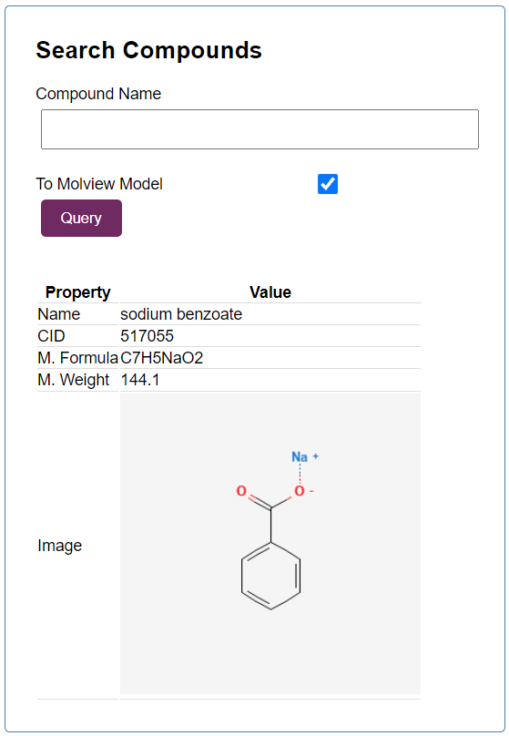
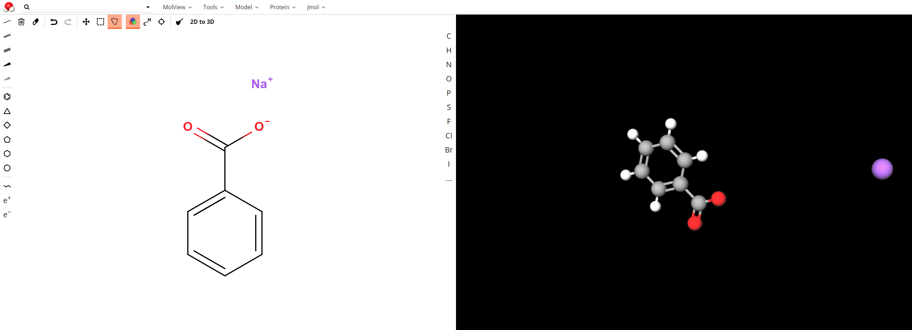

# MolSeek

Welcome to MolSeek!

This project is a WebApp that aims to provide users with a way to seek out specific details of chemical compounds quickly.\
This project uses `JSON-Server` as a mock database. Previously searched chemical compounds and analytics are stored in the database.\
MolSeek allows users to search for chemical compounds by PubChem CID or by name.\
When a compound is searched, the interface will display the necessary information about the compound, alongside some visualizations.\
If the `To Molview Model` checkbox is clicked, the compound will be visualized within `Molview` as well, upon searching.

The interface for the application can be seen below:

## Example

Let's say we want to know more about the compound `Sodium Benzoate`.\
Using MolSeek, we type in the name or CID or `Sodium Benzoate`.\
Let's now say that we wish to visualize the compound within `MolView`.\
To do so, we check the `To Molview Model` box.\
Upon searching, our interface looks something like this:

And the `MolView` model is displayed in a new tab:

